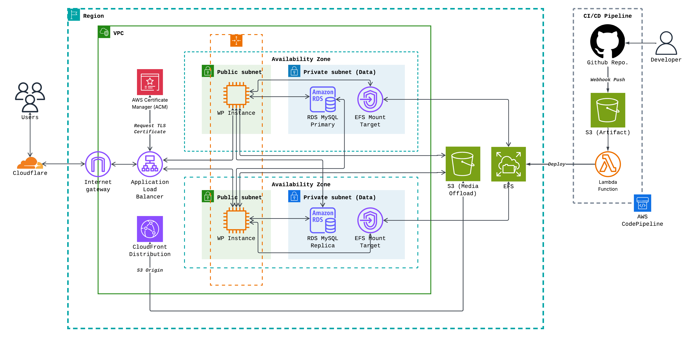

A production-ready Terraform boilerplate for deploying a High Availability (HA) WordPress infrastructure on AWS. This project automates the provisioning of a secure, scalable Multi-AZ architecture, integrated with Cloudflare for DNS and SSL management.
=======
# High Availability WordPress on AWS with Terraform


A production-ready **Infrastructure as Code (IaC)** solution for deploying a scalable, secure, and highly available WordPress environment on AWS. This repository includes the **Terraform** infrastructure modules.

---

## Table of Contents

- [Architecture Overview](#-architecture-overview)
- [Key Features](#-key-features)
- [Project Structure](#-project-structure)
- [Prerequisites](#-prerequisites)
- [Getting Started](#-getting-started)
  - [1. Clone Repository](#1-clone-repository)
  - [2. Configuration](#2-configuration)
  - [3. Deployment](#3-deployment)
- [Clean Up](#-clean-up)

---

## Architecture Overview

This project deploys a **Multi-AZ** architecture ensuring redundancy and fault tolerance.



### Infrastructure Components:
* **VPC**: Custom VPC with 2 Public Subnets (Web Tier) and 2 Private Subnets (Database Tier).
* **Compute**:
    * **EC2 Auto Scaling Group**: Automatically scales web servers (Ubuntu) between 2 to 4 instances based on traffic.
    * **Application Load Balancer (ALB)**: Distributes traffic and handles SSL termination.
* **Storage**:
    * **Amazon RDS (MySQL)**: Managed database placed in private subnets for security.
    * **Amazon EFS**: Shared file system mounted to `/wp-content/uploads` on all instances to synchronize media files.
* **Security**:
    * **AWS Secrets Manager**: Automatically generates and rotates database credentials (no hard-coded passwords).
    * **Security Groups**: Strict firewall rules (Least Privilege Principle).
    * **End-to-End Encryption**: Full HTTPS from Client -> Cloudflare -> ALB -> EC2.
* **DNS & CDN**: Integration with **Cloudflare** for DNS management and edge caching.

---

## Key Features

- **Automated Provisioning**: Full infrastructure deployment with a single `terraform apply`.
- **Zero-Touch Secrets**: Database passwords are generated by AWS Secrets Manager and injected securely into the application at runtime.
- **Cost Optimized**: Uses Public Subnets for EC2 to avoid NAT Gateway costs, while keeping the Database secure in Private Subnets.
- **Self-Healing**: Auto Scaling Group replaces unhealthy instances automatically.
- **Custom Theme Included**: Comes with a pre-configured, performance-optimized WordPress theme.

---

## Project Structure

```bash
├── main.tf                 # Main orchestration file
├── variables.tf            # Variable definitions (customizable)
├── outputs.tf              # Output definitions (DNS, Endpoints)
├── providers.tf            # AWS & Cloudflare provider config
├── terraform.tfvars        # User-specific variables (Ignored by Git)
├── modules/                # Terraform Modules
│   ├── vpc/                # Networking logic
│   ├── security_groups/    # Firewall rules
│   ├── secrets/            # Secrets Manager logic
│   ├── rds/                # Database logic
│   ├── efs/                # Shared storage logic
│   ├── compute/            # EC2, ASG, ALB logic
│   └── cloudflare/         # DNS & SSL verification
└── scripts/
    └── user_data.sh        # Server bootstrapping (Nginx, PHP, Mount EFS)
```

# Prerequisites

Before you begin, ensure you have the following:

1. **Terraform CLI** (v1.0.0+).
2. **AWS CLI** configured with appropriate permissions.
3. **Cloudflare Account**:
   - A domain name added to Cloudflare.
   - Zone ID.
   - API Token with **Edit Zone DNS** permissions.
4. **SSH Key Pair** (Optional):  
   If you want to SSH into instances, or let Terraform create one for you.

---

## Getting Started

### 1. Clone Repository

```bash
git clone https://github.com/your-username/ha-wordpress-aws.git
cd ha-wordpress-aws
```

---

### 2. Configuration

Create a `terraform.tfvars` file in the root directory to define your environment-specific variables:

```hcl
# terraform.tfvars

project_name         = "my-shop"
aws_region           = "ap-southeast-1"
domain_name          = "example.com"

# Cloudflare Settings
cloudflare_zone_id   = "your_zone_id_here"
cloudflare_api_token = "your_api_token_here"

# Instance Sizing
instance_type        = "t3.micro"
db_instance_class    = "db.t3.micro"
db_name              = "prod_db"
```

---

### 3. Deployment

Initialize Terraform and download providers:

```bash
terraform init
```

Review the execution plan:

```bash
terraform plan
```

Apply the infrastructure:

```bash
terraform apply
```

**Note:**  
The process includes DNS validation for SSL certificates via Cloudflare, which may take a few minutes.  
Once finished, Terraform will output your **Load Balancer DNS** and **Database Endpoint**.

---

## Clean Up

To destroy all resources and stop incurring costs:

```bash
terraform destroy
```
